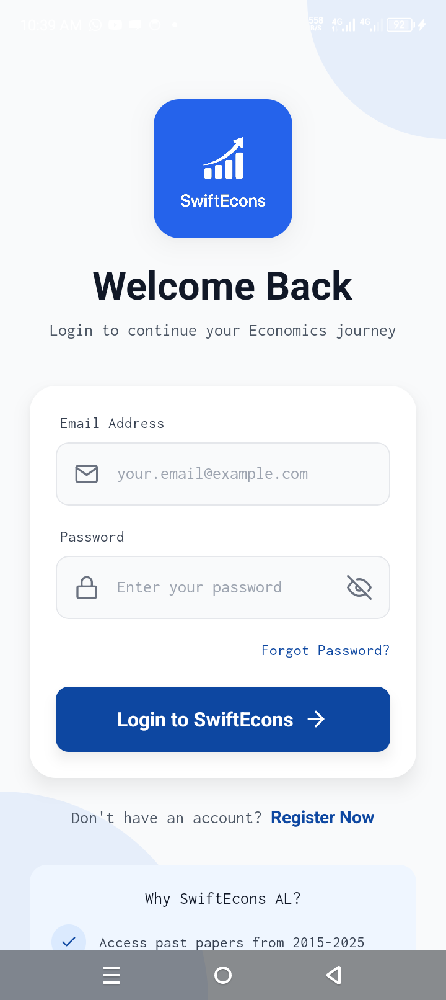

# SwiftEcons

<div style="display: flex; flex-wrap: wrap; gap: 10px;">
  
  
  
  
</div>


## Overview

SwiftEcons is a React Native application designed to provide economics past papers and study tools for students. It utilizes a Node.js backend with Express.js and MongoDB to manage user authentication and data.

## Features

*   **User Authentication:** Secure user registration and login functionality.
*   **Past Papers:** Access a collection of economics past papers from various years.
*   **PDF Viewer:** Integrated PDF viewer for seamless access to past paper content.
*   **Secrets Management:** Allows users to store and manage sensitive information securely.
*   **Dark Mode:** User-friendly dark mode for comfortable viewing in low-light conditions.
*   **Feedback & Support:** In-app feedback form and support resources.


## Technologies Used

*   **Frontend:**
    *   React Native
    *   Expo
    *   NativeWind (Tailwind CSS)
    *   Expo Router
*   **Backend:**
    *   Node.js
    *   Express.js
    *   MongoDB
    *   Mongoose
*   **Other:**
    *   dotenv
    *   cors

## Installation

1.  **Clone the repository:**

    ```bash
    git clone [repository URL]
    cd SwiftEcons
    ```

2.  **Install dependencies:**

    ```bash
    npm install
    cd backend
    npm install
    cd ..
    ```

3.  **Configure environment variables:**

    *   Create a `.env` file in the `backend` directory.
    *   Add the following environment variables:

        ```
        MONGO_URI=[Your MongoDB Connection String]
        PORT=[Desired Port Number, e.g., 5000]
        ```

4.  **Run the backend server:**

    ```bash
    cd backend
    npm run start
    ```

5.  **Run the React Native app:**

    ```bash
    npm run start
    ```

    This will start the Expo development server. You can then run the app on your iOS or Android device using the Expo Go app, or by using an emulator.

## Usage

1.  **Register/Login:** Create an account or log in to access the app's features.
2.  **Browse Past Papers:** Navigate to the "Past Papers" section to view papers by year.
3.  **View PDFs:** Select a paper to view it in the integrated PDF viewer.
4.  **Manage Secrets:** Use the "Secrets" feature to store and manage sensitive information securely.
5.  **Customize Appearance:** Toggle dark mode in the settings for a comfortable viewing experience.
6.  **Provide Feedback:** Use the feedback form to submit suggestions or report issues.

## Contributing

[**If you want to encourage contributions, add guidelines here.**]

## License

[**Add license information here.**]
